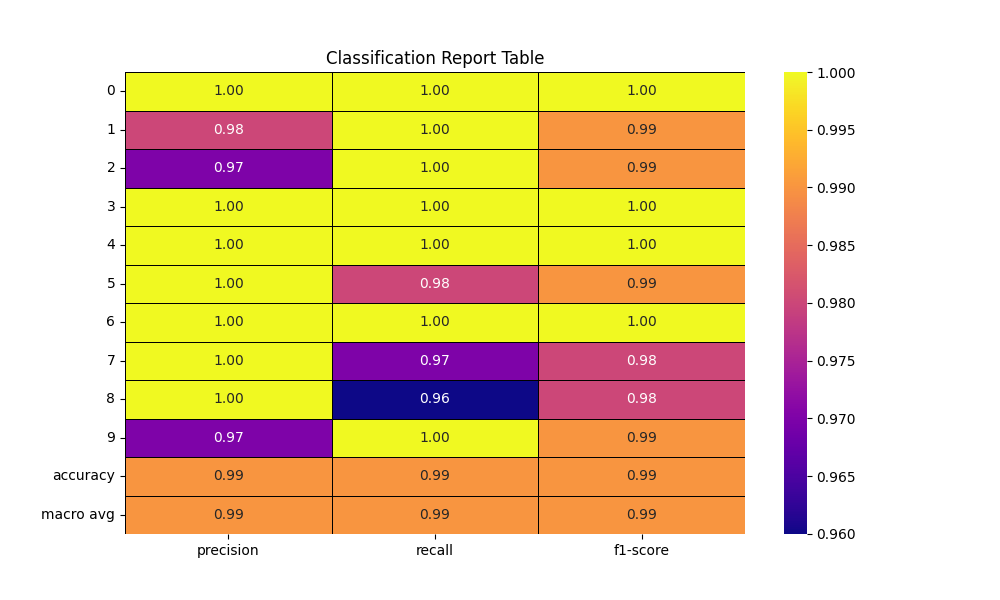
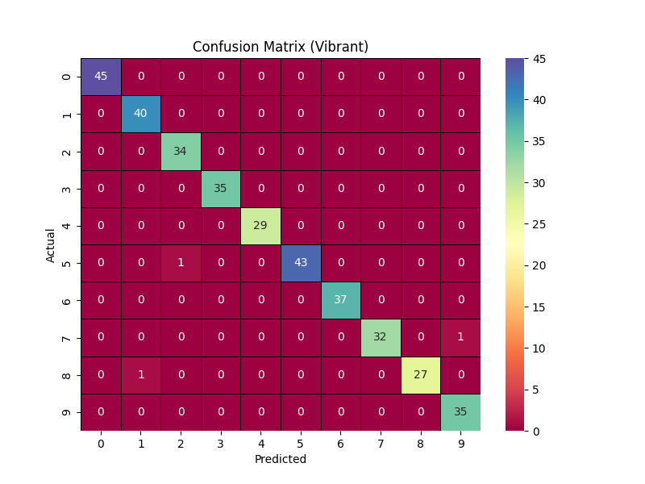

# Handwritten-Digit-Recognition-with-Logistic-Regression
 

## Project Overview

This project trains and tests a logistic regression model using handwritten digit data. It focuses on:
- Extracting training and test data from other sources
- Normalizing and calibrating input data
- Manually tuning model parameters
- Comparing how different datasets affect model accuracy

📄 Report: [Read the full report (PDF)](./Handwritten-Digit-Recognition-with-Logistic-Regression.pdf)

---

## Main Goals

- Train and test a logistic regression model on digit data
- Explore manual tuning instead of auto-optimization
- Understand how data impacts model performance

---

## Steps

1. Extract and convert image datasets to CSV
2. Normalize and calibrate pixel values
3. Split data into training (80%) and testing (20%)
4. Train with various settings (`max_iter`, `C`, `solver`)
5. Evaluate with accuracy, F1, confusion matrix, and plots

---

## Dataset Comparison

- `load_digits`: 8x8 grayscale digits
- `MNIST`: 28x28 grayscale digits  
Compares their impact on accuracy and tuning needs.

---

## Key Takeaways

- 99.2% accuracy on `load_digits`
- 92.2% on MNIST (more complex)
- Manual tuning improves results
- Data type and size affect performance

---

## License

MIT
